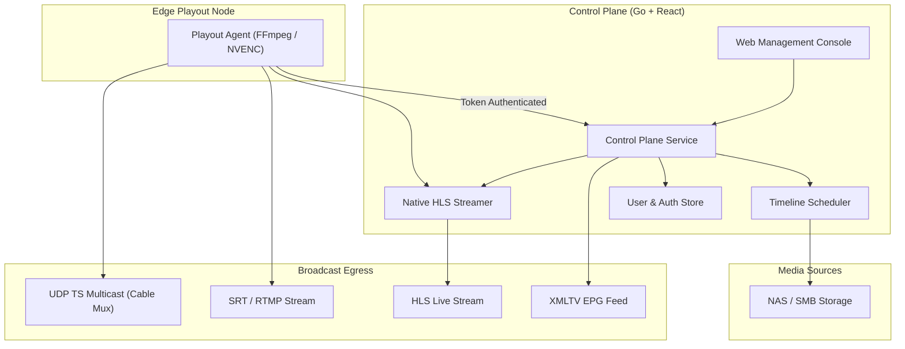

# MCRFlow

MCRFlow is a modern, web-based TV playout and master control system written in Go and React. It is designed to run 24/7 linear channels reliably without relying on expensive legacy hardware dongles or clunky desktop software.

Whether you run a local digital cable channel, an educational television network, or a FAST streaming station, MCRFlow gives you scheduling, on-screen graphics, direct HLS live streaming, and automated EPG generation through a clean web interface.

---

## Architecture

The system is split into two parts: a central **Control Plane** (which serves the web UI and handles scheduling/metadata) and lightweight **Edge Playout Agents** (which do the actual video encoding and stream delivery).



---

## What It Does

- **Multi-Channel Playout**: Manage multiple channels from one dashboard. Each channel can be assigned to an edge node with an optional hot-standby node for automatic failover.
- **24/7 Timeline Scheduling**: Drag and drop videos from connected storage mounts (NAS, SMB, or local disk). Durations are automatically detected, and movie details (posters, descriptions) are pulled directly from TMDb for accurate EPGs.
- **On-Screen Graphics & Ad Maker**: Add channel logos, lower-third banners, scrolling news tickers, and scheduled commercial breaks without needing third-party video editors.
- **Built-in HLS Live Streaming**: Channels can be streamed directly from MCRFlow's web server. Playlists maintain a live 10-segment rolling window, automatically deleting older segments from disk to keep storage clean.
- **Indian Cable & Regional TV Presets**: Ready-to-use video presets for Indian broadcast operations (1080i50 PAL HD, 720p50, 576i SD 4:3, and 576i anamorphic 16:9), along with custom FFmpeg filter chains (`yadif` deinterlacing, EBU R128 loudness normalization).
- **Multilingual Web Interface**: Defaults to English and includes full native translations for 10 Indian regional languages (Hindi, Tamil, Telugu, Bengali, Marathi, Gujarati, Kannada, Malayalam, Punjabi, Odia).
- **Telegram Bot ChatOps**: Schedule content using natural language (e.g. *"Schedule Avengers at 16:30"*). The bot fuzzy-searches the media mount, reports conflicts, and lets you queue or replace programs right from chat.

---

## Access & User Roles

When you first launch MCRFlow, you will be prompted to create the initial administrator account. Once created, all administrative actions require signing in.

MCRFlow comes with three built-in roles:
- **Admin**: Full control over channels, edge nodes, storage mounts, system settings, and user accounts.
- **Operator**: Day-to-day channel operations, playout controls, ad templates, and emergency standby slate triggering.
- **Content Scheduler**: Dedicated to media scheduling, browsing storage, and probing video files. Schedulers cannot alter channel configurations, pair edge agents, or manage user accounts.

### Stream & EPG Security
By default, the XMLTV EPG endpoint and live HLS stream can be accessed publicly. If you want to protect them, you can configure an optional **WebToken** in the channel settings. When set, requests must include `?token=YOUR_TOKEN`, or the server returns `401 Unauthorized`.

---

## Docker Storage & Volume Mounts Explained

MCRFlow uses two primary volume mounts when running in Docker:

1. **`-v <host-path>:/data/mcrflow` (Read-Write)**
   - **What it is**: The system's persistent state directory.
   - **What it stores**: User accounts, Bcrypt password hashes, channel configurations, custom resolution profiles, ad templates, agent pairing tokens, and the 10-segment rolling HLS live cache.
   - **Permission**: Must be read-write (`rw`). If this directory is not mounted, state will be lost when the container is recreated.

2. **`-v <host-path>:/media/storage:ro` (Read-Only)**
   - **What it is**: Your content library where movies, shows, audio tracks, and bumper video files are located.
   - **Why `:ro` (Read-Only)?**: Linear playout engines only need to read frames and probe metadata. Mounting `:ro` prevents playout processes or operators from accidentally modifying, truncating, or deleting original master video files.
   - **Multiple Mounts**: You can mount additional folders as needed (e.g. `-v /mnt/nas/promos:/media/promos:ro` or `-v /mnt/san/commercials:/media/commercials:ro`). MCRFlow's storage manager lets you browse and schedule from any mounted path.

---

## Configuration: CLI Flags & Environment Variables

Every setting can be configured either through command-line flags or environment variables. CLI flags take precedence over environment variables, which fall back to sensible defaults.

### Control Plane (`mcrflow-control`)

| CLI Flag | Environment Variable | Default | Description |
| :--- | :--- | :--- | :--- |
| `--port` | `MCRFLOW_PORT` or `PORT` | `8080` | HTTP listening port for UI, REST API, and native HLS stream |
| `--data-dir` | `MCRFLOW_DATA_DIR` or `MCRFLOW_STORAGE_PATH` | `./data` (`/data/mcrflow` in Docker) | Directory for databases, auth state, and HLS rolling cache |
| `--media-dir` | `MCRFLOW_MEDIA_DIR` | `/media/storage` | Default media directory auto-registered in the storage browser |
| `--tmdb-key` | `MCRFLOW_TMDB_KEY` | `""` | Optional TMDb API key for automatic movie/series metadata lookup |
| `--ui-dir` | `MCRFLOW_UI_DIR` | `./ui-mockup` | Path to static web console files |

### Edge Playout Agent (`mcrflow-agent`)

| CLI Flag | Environment Variable | Default | Description |
| :--- | :--- | :--- | :--- |
| `--agent-id` | `MCRFLOW_AGENT_ID` | System hostname | Unique identifier for this edge playout node |
| `--port` | `MCRFLOW_PORT` or `PORT` | `9095` | Agent RPC / API listening port for control plane communication |
| `--auth-file` | `MCRFLOW_AUTH_FILE` | `<data-dir>/agent_auth.json` | Path to persistent 256-bit cryptographic pairing token file |
| `--data-dir` | `MCRFLOW_DATA_DIR` | `./data` (`/data/mcrflow` in Docker) | Base directory for agent persistent state |
| `--media-dir` | `MCRFLOW_MEDIA_DIR` | `/media/storage` | Content mount path for video playback |

---

## Running with Docker by Operating System

### 1. Linux (Bash)

**All-in-One Mode (Control Plane + Embedded Agent):**
```bash
docker run -d \
  --name mcrflow \
  --restart unless-stopped \
  -p 8080:8080 \
  -p 9095:9095 \
  -e MCRFLOW_PORT=8080 \
  -e MCRFLOW_DATA_DIR=/data/mcrflow \
  -v /var/lib/mcrflow:/data/mcrflow \
  -v /mnt/storage/movies:/media/storage:ro \
  ghcr.io/mcrflow/mcrflow:latest
```

**Edge-Only Agent Node:**
```bash
docker run -d \
  --name mcrflow-agent-delhi \
  --restart unless-stopped \
  -p 9095:9095 \
  -e MCRFLOW_AGENT_ID="delhi-edge-primary" \
  -v /var/lib/mcrflow-agent:/data/mcrflow \
  -v /mnt/storage/movies:/media/storage:ro \
  ghcr.io/mcrflow/mcrflow-agent:latest
```

---

### 2. macOS (Terminal / zsh)

**All-in-One Mode:**
```bash
docker run -d \
  --name mcrflow \
  --restart unless-stopped \
  -p 8080:8080 \
  -p 9095:9095 \
  -v "$HOME/mcrflow-data:/data/mcrflow" \
  -v "/Volumes/MediaDrive/Movies:/media/storage:ro" \
  ghcr.io/mcrflow/mcrflow:latest
```

**Edge-Only Agent Node:**
```bash
docker run -d \
  --name mcrflow-agent \
  --restart unless-stopped \
  -p 9095:9095 \
  -e MCRFLOW_AGENT_ID="mac-edge-studio" \
  -v "$HOME/mcrflow-agent-data:/data/mcrflow" \
  -v "/Volumes/MediaDrive/Movies:/media/storage:ro" \
  ghcr.io/mcrflow/mcrflow-agent:latest
```

---

### 3. Windows (PowerShell)

**All-in-One Mode:**
```powershell
docker run -d `
  --name mcrflow `
  --restart unless-stopped `
  -p 8080:8080 `
  -p 9095:9095 `
  -v C:\mcrflow\data:/data/mcrflow `
  -v D:\BroadcastMedia\Movies:/media/storage:ro `
  ghcr.io/mcrflow/mcrflow:latest
```

**Edge-Only Agent Node:**
```powershell
docker run -d `
  --name mcrflow-agent `
  --restart unless-stopped `
  -p 9095:9095 `
  -e MCRFLOW_AGENT_ID="win-edge-01" `
  -v C:\mcrflow\agent-data:/data/mcrflow `
  -v D:\BroadcastMedia\Movies:/media/storage:ro `
  ghcr.io/mcrflow/mcrflow-agent:latest
```

---

### 4. Windows (Command Prompt `cmd.exe`)

**All-in-One Mode:**
```cmd
docker run -d ^
  --name mcrflow ^
  --restart unless-stopped ^
  -p 8080:8080 ^
  -p 9095:9095 ^
  -v C:\mcrflow\data:/data/mcrflow ^
  -v D:\BroadcastMedia\Movies:/media/storage:ro ^
  ghcr.io/mcrflow/mcrflow:latest
```

**Edge-Only Agent Node:**
```cmd
docker run -d ^
  --name mcrflow-agent ^
  --restart unless-stopped ^
  -p 9095:9095 ^
  -e MCRFLOW_AGENT_ID="win-edge-01" ^
  -v C:\mcrflow\agent-data:/data/mcrflow ^
  -v D:\BroadcastMedia\Movies:/media/storage:ro ^
  ghcr.io/mcrflow/mcrflow-agent:latest
```

---

### Getting the Pairing Token

When an edge agent starts for the first time, check its logs to retrieve the pairing token:
```bash
docker logs mcrflow-agent
```
Paste this token into the MCRFlow web interface (**Settings > Edge Agents > Pair Node**). The token is saved in the mounted `/data/mcrflow` volume and persists across container restarts and host reboots.

---

### Docker Compose

For multi-node setups with a central control plane, a primary playout agent, and a hot-standby agent:

```yaml
version: "3.9"

services:
  control-plane:
    image: ghcr.io/mcrflow/mcrflow:latest
    container_name: mcrflow-control
    ports:
      - "8080:8080"
    environment:
      - MCRFLOW_PORT=8080
      - MCRFLOW_DATA_DIR=/data/mcrflow
      - MCRFLOW_MEDIA_DIR=/media/storage
    volumes:
      - mcrflow-data:/data/mcrflow
      - /mnt/storage/movies:/media/storage:ro
    restart: always

  edge-primary:
    image: ghcr.io/mcrflow/mcrflow-agent:latest
    container_name: mcrflow-edge-primary
    ports:
      - "9095:9095"
    environment:
      - MCRFLOW_AGENT_ID=delhi-edge-primary
      - MCRFLOW_PORT=9095
      - MCRFLOW_DATA_DIR=/data/mcrflow
    volumes:
      - edge1-data:/data/mcrflow
      - /mnt/storage/movies:/media/storage:ro
    restart: always

  edge-standby:
    image: ghcr.io/mcrflow/mcrflow-agent:latest
    container_name: mcrflow-edge-standby
    ports:
      - "9096:9095"
    environment:
      - MCRFLOW_AGENT_ID=mumbai-edge-standby
      - MCRFLOW_PORT=9095
      - MCRFLOW_DATA_DIR=/data/mcrflow
    volumes:
      - edge2-data:/data/mcrflow
      - /mnt/storage/movies:/media/storage:ro
    restart: always

volumes:
  mcrflow-data:
  edge1-data:
  edge2-data:
```

Launch with:
```bash
docker compose up -d
```

---

## Standalone Binaries (Non-Docker)

If you prefer not to use Docker, standalone binaries for Linux, macOS, and Windows are available from the GitHub Releases page:

- **Linux**: `.deb`, `.rpm`, and `.tar.gz` packages (with systemd service support).
- **Windows**: `.zip` archive containing Windows executables.
- **macOS**: `.tar.gz` archive for both Apple Silicon and Intel.

---

## Local Development & Makefile Guide

MCRFlow includes a complete `Makefile` along with **[Air](https://github.com/air-verse/air)** configurations for instant live-reload during backend and edge development.

### 1. Install Tooling
```bash
# Clone the repository
git clone https://github.com/mcrflow/mcrflow.git
cd mcrflow

# Install Air hot-reload tool
make install-tools
# or directly: go install github.com/air-verse/air@latest
```

### 2. Available `make` Targets

| Target | Command | Description |
| :--- | :--- | :--- |
| `make dev-control` | `air -c .air.control.toml` | Run Control Plane with live auto-reload on Go file edits |
| `make dev-backend` | Alias for `dev-control` | Run Control Plane backend |
| `make dev-agent` | `air -c .air.agent.toml` | Run Edge Playout Agent with live auto-reload on Go file edits |
| `make dev-ui` | `npx serve ui-mockup -l 3000` | Start Web UI development server on `http://localhost:3000` |
| `make build` | `go build ...` | Compile all binaries (`mcrflow-control` & `mcrflow-agent`) into `./bin/` |
| `make test` | `go test -v ./...` | Run all test suites across the repository |
| `make test-unit` | `go test -v ./internal/...` | Run unit tests only |
| `make test-e2e` | `go test -v ./tests/e2e/...` | Run end-to-end integration test suite |
| `make test-race` | `go test -race -v ./...` | Run tests with Go race detector enabled |
| `make fmt` | `go fmt ./...` | Auto-format Go code |
| `make vet` | `go vet ./...` | Run Go static analysis |
| `make clean` | `rm -rf bin/ tmp/` | Clean build artifacts and temporary files |

---

### 3. Running Dev Servers

#### Terminal 1 — Control Plane (Live Reload)
```bash
make dev-control
# or directly: air -c .air.control.toml
```

#### Terminal 2 — Edge Playout Agent (Live Reload)
```bash
make dev-agent
# or directly: air -c .air.agent.toml
```

#### Terminal 3 — Web UI Development Server
```bash
make dev-ui
# or directly with npx: npx serve ui-mockup -l 3000
# or directly with Python: python -m http.server 3000 --directory ui-mockup
```

Open `http://localhost:3000` to interact with the UI, or navigate to `http://localhost:8080` where the control plane serves both the API and embedded UI assets.

---

### 4. Compiling Binaries Directly
If you prefer building without `make`:
```bash
# Build control plane binary
go build -o bin/mcrflow-control ./cmd/mcrflow-control

# Build edge agent binary
go build -o bin/mcrflow-agent ./cmd/mcrflow-agent
```

---

## Contributing

Contributions and bug reports are welcome! If you find an issue or have a feature request, please open an issue or submit a pull request. Make sure tests pass before submitting (`go test -v ./...`).

---

## License

MCRFlow is open-source software licensed under the [Apache License 2.0](LICENSE).
