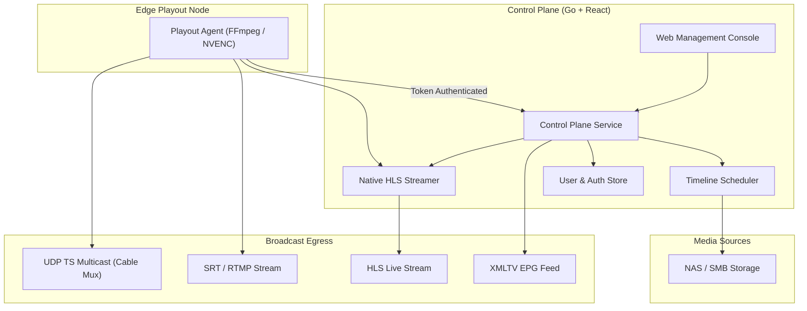

# MCRFlow

MCRFlow is a modern, web-based TV playout and master control system written in Go and React. It is designed to run 24/7 linear channels reliably without relying on expensive legacy hardware dongles or clunky desktop software.

Whether you run a local digital cable channel, an educational television network, or a FAST streaming station, MCRFlow gives you scheduling, on-screen graphics, direct HLS live streaming, and automated EPG generation through a clean web interface.

---

## Architecture

The system is split into two parts: a central **Control Plane** (which serves the web UI and handles scheduling/metadata) and lightweight **Edge Playout Agents** (which do the actual video encoding and stream delivery).



---

## What It Does

- **Multi-Channel Playout**: Manage multiple channels from one dashboard. Each channel can be assigned to an edge node with an optional hot-standby node for automatic failover.
- **24/7 Timeline Scheduling**: Drag and drop videos from connected storage mounts (NAS, SMB, or local disk). Durations are automatically detected, and movie details (posters, descriptions) are pulled directly from TMDb for accurate EPGs.
- **On-Screen Graphics & Ad Maker**: Add channel logos, lower-third banners, scrolling news tickers, and scheduled commercial breaks without needing third-party video editors.
- **Built-in HLS Live Streaming**: Channels can be streamed directly from MCRFlow's web server. Playlists maintain a live 10-segment rolling window, automatically deleting older segments from disk to keep storage clean.
- **Indian Cable & Regional TV Presets**: Ready-to-use video presets for Indian broadcast operations (1080i50 PAL HD, 720p50, 576i SD 4:3, and 576i anamorphic 16:9), along with custom FFmpeg filter chains (`yadif` deinterlacing, EBU R128 loudness normalization).
- **Multilingual Web Interface**: Defaults to English and includes full native translations for 10 Indian regional languages (Hindi, Tamil, Telugu, Bengali, Marathi, Gujarati, Kannada, Malayalam, Punjabi, Odia).
- **Telegram Bot ChatOps**: Schedule content using natural language (e.g. *"Schedule Avengers at 16:30"*). The bot fuzzy-searches the media mount, reports conflicts, and lets you queue or replace programs right from chat.

---

## Access & User Roles

When you first launch MCRFlow, you will be prompted to create the initial administrator account. Once created, all administrative actions require signing in.

MCRFlow comes with three built-in roles:
- **Admin**: Full control over channels, edge nodes, storage mounts, system settings, and user accounts.
- **Operator**: Day-to-day channel operations, playout controls, ad templates, and emergency standby slate triggering.
- **Content Scheduler**: Dedicated to media scheduling, browsing storage, and probing video files. Schedulers cannot alter channel configurations, pair edge agents, or manage user accounts.

### Stream & EPG Security
By default, the XMLTV EPG endpoint and live HLS stream can be accessed publicly. If you want to protect them, you can configure an optional **WebToken** in the channel settings. When set, requests must include `?token=YOUR_TOKEN`, or the server returns `401 Unauthorized`.

---

## Quick Start with Docker

### All-in-One Mode (Control Plane + Agent)
If you want to run everything on a single machine:

```bash
docker run -d \
  --name mcrflow \
  -p 8080:8080 \
  -p 9095:9095 \
  -v /var/data/mcrflow:/data/mcrflow \
  -v /mnt/storage/movies:/media/storage:ro \
  ghcr.io/mcrflow/mcrflow:latest
```

Open `http://localhost:8080` in your browser to complete the first-time setup wizard.

---

### Agent-Only Mode (Distributed Edge)
If you want to run the playout agent on a separate server or in a data center:

```bash
docker run -d \
  --name mcrflow-agent \
  --restart unless-stopped \
  -p 9095:9095 \
  -v /var/data/mcrflow-agent:/data/mcrflow \
  -v /mnt/storage/movies:/media/storage:ro \
  ghcr.io/mcrflow/mcrflow-agent:latest \
  --agent-id "delhi-edge-primary"
```

Check the container logs to find the auto-generated pairing token:
```bash
docker logs mcrflow-agent
```
Copy the token and paste it into the MCRFlow web interface under **Settings > Edge Agents > Pair Node**.

---

### Docker Compose

For a standard setup with a control plane and two agents (primary and standby):

```yaml
version: "3.9"

services:
  control-plane:
    image: ghcr.io/mcrflow/mcrflow:latest
    container_name: mcrflow-control
    ports:
      - "8080:8080"
    volumes:
      - mcrflow-data:/data/mcrflow
      - /mnt/storage/movies:/media/storage:ro
    restart: always

  edge-primary:
    image: ghcr.io/mcrflow/mcrflow-agent:latest
    container_name: mcrflow-edge-primary
    ports:
      - "9095:9095"
    volumes:
      - edge1-data:/data/mcrflow
      - /mnt/storage/movies:/media/storage:ro
    restart: always

  edge-standby:
    image: ghcr.io/mcrflow/mcrflow-agent:latest
    container_name: mcrflow-edge-standby
    ports:
      - "9096:9095"
    volumes:
      - edge2-data:/data/mcrflow
      - /mnt/storage/movies:/media/storage:ro
    restart: always

volumes:
  mcrflow-data:
  edge1-data:
  edge2-data:
```

Start the services:
```bash
docker compose up -d
```

---

## Standalone Binaries (Non-Docker)

If you prefer not to use Docker, standalone binaries for Linux, macOS, and Windows are available from the GitHub Releases page:

- **Linux**: `.deb`, `.rpm`, and `.tar.gz` packages (with systemd service support).
- **Windows**: `.zip` archive containing Windows executables.
- **macOS**: `.tar.gz` archive for both Apple Silicon and Intel.

---

## Building from Source

### Prerequisites
- **Go 1.23+**
- **FFmpeg 6.0+** with `libx264` (and NVENC or VAAPI for hardware acceleration)

### Build Commands
```bash
# Clone the repository
git clone https://github.com/mcrflow/mcrflow.git
cd mcrflow

# Build the control plane service
go build -o bin/mcrflow-control ./cmd/mcrflow-control

# Build the edge agent
go build -o bin/mcrflow-agent ./cmd/mcrflow-agent
```

### Running Tests
```bash
# Run all unit tests
go test -v ./internal/...

# Run the end-to-end integration test
go test -v ./tests/e2e/...
```

---

## Contributing

Contributions and bug reports are welcome! If you find an issue or have a feature request, please open an issue or submit a pull request. Make sure tests pass before submitting (`go test -v ./...`).

---

## License

MCRFlow is open-source software licensed under the [Apache License 2.0](LICENSE).
