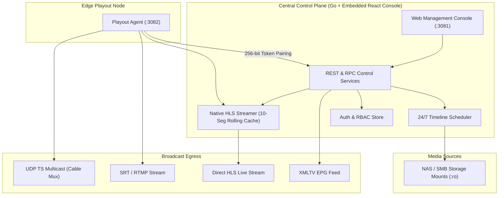

# MCRFlow

MCRFlow is an open-source, web-based TV playout automation and master control system written in Go and React. It is engineered to run 24/7 broadcast television and linear streaming channels reliably without expensive legacy hardware dongles or complex desktop client setups.

Whether you run a digital cable television channel, an educational network, or a 24/7 FAST streaming station, MCRFlow gives you timeline scheduling, on-screen graphics, ad insertion, direct HLS live streaming, and automated EPG generation through a clean web console.

---

## Architecture

The system consists of two core components: a central **Control Plane** (serving the embedded web UI, managing timeline schedules, and providing REST APIs) and lightweight **Edge Playout Agents** (executing video transcoding, graphics compositing, and network stream egress).



---

## Core Capabilities

- **Multi-Channel Playout**: Manage unlimited channels from a single dashboard. Assign channels to dedicated edge nodes with hot-standby fallback for seamless redundancy.
- **24/7 Timeline Scheduler**: Drag and drop media from local directories, NAS, or SMB mounts. Video durations are probed automatically, and program metadata (posters, synopses) is fetched directly from TMDb for accurate Electronic Program Guides (EPG).
- **On-Screen Graphics & Ad Studio**: Position channel bugs/logos, lower-third tickers, and scheduled commercial breaks without third-party video editors. Supports content-level and channel-level template precedence.
- **Direct Live HLS Streaming**: Channels can be streamed directly from MCRFlow's web server. The player maintains a 10-segment sliding window and automatically prunes stale segments from disk.
- **Indian Cable & Regional TV Presets**: Ready-to-use broadcast resolution presets (1080i50 PAL HD, 720p50, 576i SD 4:3, 576i anamorphic 16:9) with FFmpeg deinterlacing (`yadif`) and EBU R128 loudness normalization.
- **Multilingual Web Console**: Defaults to English and includes full native translations for 10 Indian regional languages (Hindi, Tamil, Telugu, Bengali, Marathi, Gujarati, Kannada, Malayalam, Punjabi, Odia).
- **ChatOps Scheduling**: Schedule programs via Telegram bots using natural language (e.g. *"Schedule Avengers at 16:30"*). The bot fuzzy-searches connected mounts and detects scheduling conflicts.

---

## Access & User Roles

When MCRFlow is first booted, a setup wizard prompts you to create the initial root administrator account. All administrative endpoints require authentication.

Three distinct roles are supported:
- **Admin**: Full access across all channels, edge agent pairing, storage mounts, system settings, and user management.
- **Operator**: Daily operational playout control, schedule viewing, ad template design, and emergency slate triggering.
- **Content Scheduler**: Restricted strictly to media scheduling, browsing mounted storage, and probing video metadata. Cannot modify channel stream settings, pair edge nodes, or alter users.

### Optional Stream & EPG Token Authentication
By default, the XMLTV EPG endpoint and live HLS stream are public. To restrict playback, set an optional **WebToken** in the channel settings. When enabled, requests require `?token=YOUR_TOKEN`, otherwise returning `401 Unauthorized`.

---

## Running Standalone Release Binaries by OS

Precompiled binaries for Linux, macOS, and Windows are published for every release on [GitHub Releases](https://github.com/varmakarthik12/mcrflow/releases). The Control Plane binary is completely self-contained with the Web Management Console embedded inside.

### 1. Linux (`amd64` / `arm64`)

#### Step 1: Install Playout Runtime (Edge Agents)
For nodes running playout encoding and media probing, install FFmpeg:
```bash
sudo apt update && sudo apt install -y ffmpeg ca-certificates
```

#### Step 2: Download & Run Control Plane
```bash
# Download the latest release for Linux amd64 (or arm64)
curl -LO https://github.com/varmakarthik12/mcrflow/releases/latest/download/mcrflow-control_1.0.0_linux_amd64.tar.gz
tar -xzf mcrflow-control_1.0.0_linux_amd64.tar.gz

# Run the control plane
./mcrflow-control --port 3081 --data-dir ./data
```
Open `http://localhost:3081` in your browser to launch the web console.

#### Step 3: Download & Run Edge Playout Agent
```bash
curl -LO https://github.com/varmakarthik12/mcrflow/releases/latest/download/mcrflow-agent_1.0.0_linux_amd64.tar.gz
tar -xzf mcrflow-agent_1.0.0_linux_amd64.tar.gz

# Start the edge agent daemon
./mcrflow-agent --agent-id delhi-edge-01 --port 3082
```
On initial boot, the agent prints its cryptographic pairing token in the console:
```text
================================================================================
  MCRFLOW EDGE PLAYOUT AGENT - CRYPTOGRAPHIC PAIRING REQUIRED
  Agent ID:      delhi-edge-01
  Pairing Token: agt_sec_a1b2c3d4...
================================================================================
```
Copy and paste this token into the web UI (**Settings > Edge Agents > Pair Node**).

#### Optional: Run as a `systemd` Service
Create `/etc/systemd/system/mcrflow-control.service`:
```ini
[Unit]
Description=MCRFlow Master Control Plane
After=network.target

[Service]
Type=simple
User=mcrflow
WorkingDirectory=/var/lib/mcrflow
ExecStart=/usr/local/bin/mcrflow-control --port 3081 --data-dir /var/lib/mcrflow/data
Restart=always
RestartSec=5

[Install]
WantedBy=multi-user.target
```
Enable and start the service:
```bash
sudo systemctl daemon-reload
sudo systemctl enable --now mcrflow-control
```

---

### 2. macOS (Apple Silicon `arm64` & Intel `amd64`)

#### Step 1: Install FFmpeg (Optional for Edge Nodes)
```bash
brew install ffmpeg
```

#### Step 2: Download & Extract
Download the appropriate archive from [GitHub Releases](https://github.com/varmakarthik12/mcrflow/releases):
- Apple Silicon (M1/M2/M3/M4): `mcrflow-control_1.0.0_darwin_arm64.tar.gz`
- Intel Mac: `mcrflow-control_1.0.0_darwin_amd64.tar.gz`

```bash
# Example for Apple Silicon:
tar -xzf mcrflow-control_1.0.0_darwin_arm64.tar.gz
tar -xzf mcrflow-agent_1.0.0_darwin_arm64.tar.gz

# If downloaded via Safari/Chrome, clear the macOS quarantine attribute:
xattr -d com.apple.quarantine mcrflow-control 2>/dev/null || true
xattr -d com.apple.quarantine mcrflow-agent 2>/dev/null || true
```

#### Step 3: Run Binaries
```bash
# Terminal 1: Launch Control Plane
./mcrflow-control --port 3081

# Terminal 2: Launch Playout Agent
./mcrflow-agent --agent-id mac-studio-01 --port 3082
```
Access the dashboard at `http://localhost:3081`.

---

### 3. Windows (`amd64` / `arm64`)

#### Step 1: Install FFmpeg (For Edge Nodes)
Ensure `ffmpeg.exe` and `ffprobe.exe` are in your Windows `PATH`:
```powershell
winget install Gyan.FFmpeg
# or via Chocolatey: choco install ffmpeg
```

#### Step 2: Download & Extract
Download the `.zip` packages from [GitHub Releases](https://github.com/varmakarthik12/mcrflow/releases):
- `mcrflow-control_1.0.0_windows_amd64.zip`
- `mcrflow-agent_1.0.0_windows_amd64.zip`

Extract them in Explorer or via PowerShell:
```powershell
Expand-Archive -Path mcrflow-control_1.0.0_windows_amd64.zip -DestinationPath C:\mcrflow
Expand-Archive -Path mcrflow-agent_1.0.0_windows_amd64.zip -DestinationPath C:\mcrflow
```

#### Step 3: Run via PowerShell or Command Prompt
```powershell
# Start Control Plane
cd C:\mcrflow
.\mcrflow-control.exe -port 3081 -data-dir C:\mcrflow\data

# In a separate window, start Edge Agent
.\mcrflow-agent.exe -agent-id win-edge-01 -port 3082
```
Open `http://localhost:3081` in Edge, Chrome, or Firefox.

---

## Running with Docker

MCRFlow images are published to the GitHub Container Registry:
- `ghcr.io/varmakarthik12/mcrflow:latest` (All-in-One Turnkey: Control Plane + Web UI + Local Agent)
- `ghcr.io/varmakarthik12/mcrflow-agent:latest` (Headless Edge Agent)

### Volume Mounts Explained

1. **`-v <host-path>:/data/mcrflow` (Read-Write)**:
   Persistent state directory containing user credentials, channels, resolution presets, ad templates, pairing keys, and the rolling live HLS segment cache.
2. **`-v <host-path>:/media/storage:ro` (Read-Only)**:
   Your media library (movies, commercials, bumpers). Mounted `:ro` so playout processes can never accidentally modify or delete master broadcast files.

### Standalone Docker Run
```bash
# All-in-One Container
docker run -d \
  --name mcrflow \
  --restart unless-stopped \
  -p 3081:3081 \
  -p 3082:3082 \
  -v /var/lib/mcrflow:/data/mcrflow \
  -v /mnt/storage/movies:/media/storage:ro \
  ghcr.io/varmakarthik12/mcrflow:latest

# Dedicated Edge Agent
docker run -d \
  --name mcrflow-agent \
  --restart unless-stopped \
  -p 3082:3082 \
  -e MCRFLOW_AGENT_ID="delhi-edge-01" \
  -v /var/lib/mcrflow-agent:/data/mcrflow \
  -v /mnt/storage/movies:/media/storage:ro \
  ghcr.io/varmakarthik12/mcrflow-agent:latest
```

### Docker Compose (High-Availability Topology)
```yaml
version: "3.9"

services:
  control-plane:
    image: ghcr.io/varmakarthik12/mcrflow:latest
    container_name: mcrflow-control
    ports:
      - "3081:3081"
    environment:
      - MCRFLOW_PORT=3081
      - MCRFLOW_DATA_DIR=/data/mcrflow
      - MCRFLOW_MEDIA_DIR=/media/storage
    volumes:
      - mcrflow-data:/data/mcrflow
      - /mnt/storage/movies:/media/storage:ro
    restart: always

  edge-primary:
    image: ghcr.io/varmakarthik12/mcrflow-agent:latest
    container_name: mcrflow-edge-primary
    ports:
      - "3082:3082"
    environment:
      - MCRFLOW_AGENT_ID=delhi-edge-primary
      - MCRFLOW_PORT=3082
      - MCRFLOW_DATA_DIR=/data/mcrflow
    volumes:
      - edge1-data:/data/mcrflow
      - /mnt/storage/movies:/media/storage:ro
    restart: always

  edge-standby:
    image: ghcr.io/varmakarthik12/mcrflow-agent:latest
    container_name: mcrflow-edge-standby
    ports:
      - "3083:3082"
    environment:
      - MCRFLOW_AGENT_ID=mumbai-edge-standby
      - MCRFLOW_PORT=3082
      - MCRFLOW_DATA_DIR=/data/mcrflow
    volumes:
      - edge2-data:/data/mcrflow
      - /mnt/storage/movies:/media/storage:ro
    restart: always

volumes:
  mcrflow-data:
  edge1-data:
  edge2-data:
```

---

## Configuration Reference

Settings can be passed as CLI flags or environment variables (flags take precedence).

### Control Plane (`mcrflow-control`)

| CLI Flag | Environment Variable | Default | Description |
| :--- | :--- | :--- | :--- |
| `-port` | `MCRFLOW_PORT` | `3081` | HTTP listening port for Web UI, REST API, and native HLS stream |
| `-data-dir` | `MCRFLOW_DATA_DIR` | `./data` | Directory for SQLite/JSON databases, auth tokens, and HLS segments |
| `-media-dir` | `MCRFLOW_MEDIA_DIR` | `/media/storage` | Default media library path registered in storage browser |
| `-tmdb-key` | `MCRFLOW_TMDB_KEY` | `""` | Optional TMDb API key for automatic movie/series metadata lookup |

### Edge Playout Agent (`mcrflow-agent`)

| CLI Flag | Environment Variable | Default | Description |
| :--- | :--- | :--- | :--- |
| `-agent-id` | `MCRFLOW_AGENT_ID` | Hostname | Unique node identifier for this edge playout daemon |
| `-port` | `MCRFLOW_PORT` | `3082` | Agent RPC/API listening port for control plane communication |
| `-auth-file` | `MCRFLOW_AUTH_FILE` | `<data-dir>/agent_auth.json` | Path to persistent 256-bit cryptographic pairing token file |
| `-data-dir` | `MCRFLOW_DATA_DIR` | `./data` | Working directory for agent runtime state |
| `-media-dir` | `MCRFLOW_MEDIA_DIR` | `/media/storage` | Media storage mount path for clip playback |

---

## Local Development & Makefile Guide

MCRFlow includes a `Makefile` and **[Air](https://github.com/air-verse/air)** live-reload configurations.

### 1. Tooling Installation
```bash
git clone https://github.com/varmakarthik12/mcrflow.git
cd mcrflow

# Install Air live-reload tool
make install-tools
```

### 2. Common `make` Targets

| Target | Command | Description |
| :--- | :--- | :--- |
| `make dev-control` | `air -c .air.control.toml` | Run Control Plane with live auto-reload on Go file edits |
| `make dev-agent` | `air -c .air.agent.toml` | Run Edge Playout Agent with live auto-reload on Go file edits |
| `make dev-ui` | `npm --prefix web run dev` | Start Vite React dev server with Hot Module Replacement (HMR) on `http://localhost:3080` (reverse proxies to `:3081`) |
| `make build` | `go build ...` | Compile all binaries into `./bin/` |
| `make test` | `go test -v ./...` | Run all unit and integration test suites |
| `make test-unit` | `go test -v ./internal/...` | Run unit tests only |
| `make test-e2e` | `go test -v ./tests/e2e/...` | Run end-to-end integration test suite |
| `make fmt` | `go fmt ./...` | Format all Go source files |
| `make vet` | `go vet ./...` | Run Go static analysis |
| `make clean` | `rm -rf bin/ tmp/` | Clean build artifacts and temporary files |

### 3. Running Dev Servers
```bash
# Terminal 1: Control Plane with hot reload
make dev-control

# Terminal 2: Edge Agent with hot reload
make dev-agent

# Terminal 3: Vite React Web UI with Hot Module Replacement (HMR)
make dev-ui
```

---

## Contributing

Contributions and bug reports are welcome! Please open an issue or pull request on [GitHub](https://github.com/varmakarthik12/mcrflow). Verify that all tests pass (`go test -v ./...`) before submitting code.

---

## License

MCRFlow is open-source software licensed under the [Apache License 2.0](LICENSE).
