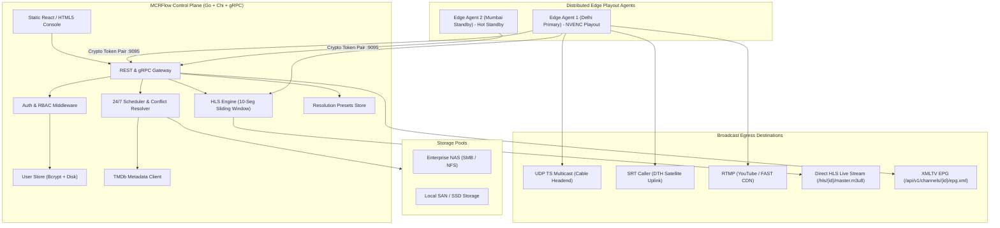

# MCRFlow

> **Enterprise-Grade Cloud-Native TV Playout Automation System**  
> Modern, distributed alternative to legacy master control software (PlayBox Neo, Beluga Playout, Cinegy Air, Pebble Beach Marina). Built with high-performance **Go** backend microservices, **React** control console, **FFmpeg / NVENC** hardware transcode pipeline, and **gRPC / REST** communication.

---

## 📑 Table of Contents

- [Overview](#overview)
- [Key Features](#key-features)
- [Architecture](#architecture)
- [Security & Authentication](#security--authentication)
  - [First-Launch Setup Wizard](#first-launch-setup-wizard)
  - [Role-Based Access Control (RBAC)](#role-based-access-control-rbac)
  - [Edge Agent Cryptographic Pairing](#edge-agent-cryptographic-pairing)
  - [WebToken Security for HLS & EPG](#webtoken-security-for-hls--epg)
- [HLS Live Streaming](#hls-live-streaming)
- [Broadcast Resolution & FFmpeg Profile Management](#broadcast-resolution--ffmpeg-profile-management)
- [Deployment & Installation](#deployment--installation)
  - [Option A: Docker All-in-One Deployment](#option-a-docker-all-in-one-deployment)
  - [Option B: Docker Distributed Agent-Only Mode](#option-b-docker-distributed-agent-only-mode)
  - [Option C: Docker Compose Full Stack](#option-c-docker-compose-full-stack)
  - [Option D: Standalone OS Binaries via GoReleaser](#option-d-standalone-os-binaries-via-goreleaser)
- [Local Development & Build Guide](#local-development--build-guide)
- [Automated Testing & Merge Pipeline](#automated-testing--merge-pipeline)
- [API Reference](#api-reference)
- [Contributing](#contributing)
- [License](#license)

---

## 🌟 Overview

**MCRFlow** is an open-source, resilient broadcast automation and Master Control Room (MCR) linear playout platform engineered to run 24/7 TV channels with zero downtime. Whether orchestrating local regional cable stations in India (PAL 50Hz, 1080i50, 576i SD) or international DTH satellite and FAST/OTT networks, MCRFlow delivers enterprise capabilities with modern web usability.

### Why MCRFlow?
- **Zero-Frame-Gap Switching**: Frame-accurate linear clip transitions and emergency slate recovery.
- **Distributed Edge Architecture**: Separate lightweight playout edge runners from central multi-channel orchestration.
- **1+1 High Availability**: Automatic active-passive failover and SMPTE 2022-7 hitless stream redundancy.
- **Direct Web HLS Streaming**: Built-in sliding-window HLS streaming engine with strictly 10 rolling segments and automatic file rotation.
- **Indian Cable TV Presets**: Native out-of-the-box configurations for Indian digital cable operators (PAL 50i/50p, 576i anamorphic 16:9 and 4:3) with real-time FFmpeg command compilation.
- **Multilingual Support**: Master console fully internationalized in English and 10 Indian regional languages (Hindi, Tamil, Telugu, Bengali, Marathi, Gujarati, Kannada, Malayalam, Punjabi, Odia).
- **Inline TMDb Integration**: Integrated metadata search during media scheduling with automated XMLTV EPG export.
- **ChatOps NLP Scheduling**: Natural language Telegram bot for scheduling content (`"Schedule Avengers at 16:30"`) with intelligent conflict handling (`OVERWRITE`, `QUEUE_AFTER`, `REJECT`).

---

## 🚀 Key Features

| Domain | Capabilities |
| :--- | :--- |
| **Playout & Egress** | Multi-protocol simultaneous output: UDP TS Multicast, SRT (Caller/Listener/Rendezvous with AES-128/256), RTMP/RTMPS, NDI, and native HTTP HLS. |
| **Graphics & Ad Studio** | WYSIWYG studio for animated bugs, lower-thirds, tickers, and SCTE-35 / SCTE-104 digital ad insertion cueing. |
| **Live HLS Engine** | Native sliding-window HLS engine (`#EXT-X-MEDIA-SEQUENCE`) serving exactly 10 active segments, with older segments automatically pruned from disk. |
| **Resolution Engine** | User-managed resolution presets with custom FFmpeg filter pipelines (`yadif` deinterlacing, EBU R128 audio loudness normalization, aspect ratios). |
| **Metadata & EPG** | Inline TMDb lookup, poster caching, audio PID track selector, subtitle track selector, and multilingual XMLTV EPG generation. |
| **Security & Auth** | First-launch administrator initialization wizard, persistent disk-backed Bcrypt user credentials, JWT session tokens, and RBAC permission enforcement. |
| **Storage Management** | Multi-mount abstraction for NAS (NFS/SMB mounts) and local disk pools, with instantaneous audio/video metadata probing. |
| **Network Mesh** | Built-in Tailscale and WireGuard integration for multi-datacenter edge node discovery and NAT traversal. |

---

## 🏗️ Architecture



---

## 🔒 Security & Authentication

MCRFlow enforces zero-trust communication across the control plane, management UI, and edge playout nodes.

### First-Launch Setup Wizard
When MCRFlow boots for the very first time on a fresh installation:
1. `GET /api/v1/auth/setup-status` returns `{"setup_required": true, "user_count": 0}`.
2. All administrative endpoints return `401 Unauthorized`.
3. The UI automatically displays the **First-Launch Setup Wizard**, prompting the user to create the primary Root Administrator (`admin`) with username, display name, official email, and a secure master password.
4. Once completed via `POST /api/v1/auth/setup`, setup is permanently locked (`setup_required: false`), and subsequent interactions require authentication via `POST /api/v1/auth/login`.

### Role-Based Access Control (RBAC)
MCRFlow provides granular role-based permissions:

| Endpoint Path | Method | `admin` | `operator` | `content_scheduler` | Public |
| :--- | :--- | :---: | :---: | :---: | :---: |
| `/api/v1/health` | GET | ✅ | ✅ | ✅ | ✅ Public |
| `/api/v1/auth/setup-status` | GET | ✅ | ✅ | ✅ | ✅ Public |
| `/api/v1/auth/setup` | POST | 🔒 First Run Only | ❌ | ❌ | First Run |
| `/api/v1/auth/login` | POST | ✅ | ✅ | ✅ | ✅ Public |
| `/api/v1/users` & `/users/*` | ANY | ✅ Full CRUD | ❌ 403 Forbidden | ❌ 403 Forbidden | ❌ |
| `/api/v1/channels` | GET | ✅ | ✅ | ✅ Read-Only | ❌ |
| `/api/v1/channels` | POST/PUT/DELETE | ✅ | ✅ | ❌ 403 Forbidden | ❌ |
| `/api/v1/channels/{id}/epg.xml` | GET | ✅ | ✅ | ✅ | ✅ (Or ?token=) |
| `/hls/{channel_id}/*` | GET | ✅ | ✅ | ✅ | ✅ (Or ?token=) |
| `/api/v1/resolutions` | POST/PUT/DELETE | ✅ | ✅ | ❌ 403 Forbidden | ❌ |
| `/api/v1/agents` & `/agents/pair` | ANY | ✅ | ✅ | ❌ 403 Forbidden | ❌ |
| `/api/v1/schedule` & `/schedule/*` | ANY | ✅ | ✅ | ✅ Full Schedule Access | ❌ |
| `/api/v1/storage/*` (Browse/Probe) | ANY | ✅ | ✅ | ✅ Full Storage Access | ❌ |
| `/api/v1/bots/nlp-command` | POST | ✅ | ✅ | ✅ Schedule via ChatOps | ❌ |
| `/api/v1/bots` (Config/Keys) | ANY | ✅ | ✅ | ❌ 403 Forbidden | ❌ |

> **Note on `content_scheduler` Role**: Dedicated media schedulers and traffic coordinators have access restricted exclusively to adding/updating playout timelines, browsing storage mounts, probing video metadata, and issuing natural language scheduling commands. All channel configuration, user management, and agent pairing APIs return `403 Forbidden`.

### Edge Agent Cryptographic Pairing
When an edge playout node boots in standalone mode:
1. It automatically generates a cryptographically secure 256-bit token (`agt_sec_<64-hex>`).
2. The token is persisted to `/data/mcrflow/agent_auth.json` and printed to the startup console.
3. System restarts preserve the token without resetting it.
4. Operators pair the agent to the central control plane via `POST /api/v1/agents/pair` by providing the agent ID, IP address, and token.

### WebToken Security for HLS & EPG
Channels support optional query-parameter security tokens:
- **`hls_web_token`**: When configured on a channel, accessing live HLS playlists and video segments (`/hls/{channel_id}/master.m3u8?token=...`) requires the exact query token. If the token is missing or invalid, the server rejects the request with `401 Unauthorized`. If not set, HLS streaming is public.
- **`epg_web_token`**: When configured on a channel, accessing the XMLTV EPG feed (`/api/v1/channels/{channel_id}/epg.xml?token=...`) requires the token. If not set, the EPG feed remains open for public distribution to cable set-top boxes and IPTV middleware.

---

## 📺 HLS Live Streaming

MCRFlow features a native sliding-window HLS packaging and distribution engine served directly from the control plane web server:
- **Strict 10-Segment Rolling Window**: The playlist (`master.m3u8`) maintains exactly 10 active segments at any given time (`MaxActiveSegments = 10`).
- **Sliding Media Sequence**: As each new MPEG-TS segment (`.ts`) is generated, `#EXT-X-MEDIA-SEQUENCE` increments, and older segments are automatically removed from disk to prevent storage exhaustion.
- **Auto-Resolved Direct Stream URLs**: Whenever a channel is created or viewed, MCRFlow automatically resolves its direct streaming endpoint (e.g. `http://playout.yourstation.tv:8080/hls/ch-01/master.m3u8?token=...`).

---

## ⚙️ Broadcast Resolution & FFmpeg Profile Management

MCRFlow includes a comprehensive Resolution & Video Profile management interface tailored for professional cable and broadcast operations:

### Default Indian Cable & Broadcast Presets:
1. **1080i50 PAL HD (`res-1080i50-pal-hd`)**: 1920x1080 @ 25fps (50 fields/s interlaced TFF), 6500 kbps CBR, EBU R128 audio normalization (-23 LUFS). The primary standard for Indian HD DTH & digital cable (Tata Play, Airtel Digital, JioFiber TV).
2. **576i50 SD 4:3 (`res-576i50-sd-4x3`)**: 720x576 @ 25fps interlaced PAL standard for legacy analog/DVB-C cable operators.
3. **576i50 SD Anamorphic 16:9 (`res-576i50-sd-16x9`)**: 720x576 16:9 DAR for modern SD digital cable.
4. **720p50 HD (`res-720p50-sports-hd`)**: 1280x720 @ 50fps progressive for fast-motion sports and news broadcasting.
5. **1080p50 Full HD (`res-1080p50-progressive`)**: 1920x1080 @ 50fps progressive for OTT/IPTV platforms.

### Custom Profile Designer
Operators can create custom resolutions with real-time FFmpeg argument compilation:
- Custom `-vf` filter chains (e.g., `yadif=0:-1:1,scale=1920:1080`, `delogo`, `unsharp`).
- Interlacing flags (`+ilme+ildct`, Top-Field First `-top 1`).
- CBR rate control (`-minrate`, `-maxrate`, `-bufsize`).
- Broadcast audio compliance (`-af loudnorm=I=-23:LRA=7:tp=-1`).

---

## 📦 Deployment & Installation

### Option A: Docker All-in-One Deployment
Runs the Control Plane, Management Web Console, and local Playout Edge Agent in a single container.

```bash
docker run -d \
  --name mcrflow-allinone \
  -p 8080:8080 \
  -p 9095:9095 \
  -v /var/data/mcrflow:/data/mcrflow \
  -v /mnt/nas/broadcast_media:/media/storage:ro \
  ghcr.io/mcrflow/mcrflow:latest
```

Open your browser to `http://localhost:8080` to launch the First-Time Setup Wizard.

---

### Option B: Docker Distributed Agent-Only Mode
Deploy lightweight edge playout nodes across multiple physical servers, datacenters, or cloud instances:

```bash
docker run -d \
  --name mcrflow-edge-01 \
  --restart unless-stopped \
  -p 9095:9095 \
  -v /var/data/mcrflow-agent:/data/mcrflow \
  -v /mnt/nas/broadcast_media:/media/storage:ro \
  ghcr.io/mcrflow/mcrflow-agent:latest \
  --agent-id "delhi-dc1-primary"
```

Inspect the container logs to retrieve the pairing token:
```bash
docker logs mcrflow-edge-01
# [MCRFlow Edge Agent] Pairing Token: agt_sec_9918bc3fa...
```
Use this token in the MCRFlow Control Console (**Settings > Edge Agents > Pair Node**) to complete authentication.

---

### Option C: Docker Compose Full Stack
For multi-channel high-availability deployments with primary and backup edge nodes:

```yaml
version: "3.9"

services:
  control-plane:
    image: ghcr.io/mcrflow/mcrflow:latest
    container_name: mcrflow-control
    ports:
      - "8080:8080"
    environment:
      - MCRFLOW_STORAGE_PATH=/data/mcrflow
      - MCRFLOW_PORT=8080
    volumes:
      - mcrflow-control-data:/data/mcrflow
      - /mnt/storage/movies:/media/storage:ro
    restart: always

  edge-primary:
    image: ghcr.io/mcrflow/mcrflow-agent:latest
    container_name: mcrflow-edge-delhi
    ports:
      - "9095:9095"
    environment:
      - MCRFLOW_AGENT_ID=delhi-dc1-primary
    volumes:
      - mcrflow-edge1-data:/data/mcrflow
      - /mnt/storage/movies:/media/storage:ro
    restart: always

  edge-standby:
    image: ghcr.io/mcrflow/mcrflow-agent:latest
    container_name: mcrflow-edge-mumbai
    ports:
      - "9096:9095"
    environment:
      - MCRFLOW_AGENT_ID=mumbai-dc2-hotstandby
    volumes:
      - mcrflow-edge2-data:/data/mcrflow
      - /mnt/storage/movies:/media/storage:ro
    restart: always

volumes:
  mcrflow-control-data:
  mcrflow-edge1-data:
  mcrflow-edge2-data:
```

Launch the cluster:
```bash
docker compose up -d
```

---

### Option D: Standalone OS Binaries via GoReleaser
Pre-compiled native binaries are published with each release for Linux, Windows, and macOS:

| Platform | Packages |
| :--- | :--- |
| **Linux (amd64 / arm64)** | `.deb`, `.rpm`, `.tar.gz` (with systemd unit service files) |
| **Windows (x64 / arm64)** | `.zip`, `.exe` (supports Windows Service installation) |
| **macOS (Apple Silicon & Intel)** | `.tar.gz` |

#### Linux installation example (Debian / Ubuntu):
```bash
wget https://github.com/mcrflow/mcrflow/releases/latest/download/mcrflow_linux_amd64.deb
sudo dpkg -i mcrflow_linux_amd64.deb
sudo systemctl enable --now mcrflow-control
```

#### Windows installation example:
```powershell
Invoke-WebRequest -Uri https://github.com/mcrflow/mcrflow/releases/latest/download/mcrflow_windows_amd64.zip -OutFile mcrflow.zip
Expand-Archive mcrflow.zip -DestinationPath C:\mcrflow
C:\mcrflow\mcrflow-control.exe --config C:\mcrflow\config.json
```

---

## 💻 Local Development & Build Guide

### Prerequisites
- **Go 1.23+**
- **Node.js 20+** & **npm**
- **FFmpeg 6.0+** (with `libx264`, `libx265`, and hardware acceleration like NVENC or VAAPI recommended)
- **Git**

### 1. Clone the Repository
```bash
git clone https://github.com/mcrflow/mcrflow.git
cd mcrflow
```

### 2. Build the Control Plane & Edge Agent
```bash
# Build Control Plane Binary
go build -v -o bin/mcrflow-control ./cmd/mcrflow-control

# Build Playout Edge Agent Binary
go build -v -o bin/mcrflow-agent ./cmd/mcrflow-agent
```

### 3. Run the Control Plane Locally
```bash
./bin/mcrflow-control --port 8080 --storage ./data
```
Visit `http://localhost:8080` in your web browser.

---

## 🧪 Automated Testing & Merge Pipeline

MCRFlow maintains a test suite covering unit, integration, and full end-to-end playout workflows.

### Running Tests Locally

```bash
# Run all unit tests across all internal packages
go test -v ./internal/...

# Run comprehensive End-to-End integration test
go test -v ./tests/e2e/...

# Run entire repository test suite with race detector
go test -race -v ./...
```

### CI/CD Merge Pipeline (`.github/workflows/ci.yml`)
Every Pull Request and branch merge runs through automated validation:
1. **Static Analysis & Linting**: `golangci-lint run`.
2. **Unit & RBAC Test Suite**: Verifies user setup, password hashing, and endpoint authorization boundaries.
3. **End-to-End Playout Verification**: Validates agent token generation, pairing, channel creation, storage probing, ChatOps NLP conflict resolution, and rolling 10-segment live HLS delivery.
4. **Multi-Architecture Docker Builds**: Builds `ghcr.io/mcrflow/mcrflow` and `ghcr.io/mcrflow/mcrflow-agent` for `linux/amd64` and `linux/arm64`.
5. **GoReleaser Artifacts Generation**: Compiles release binaries for Linux, macOS, and Windows.

---

## 🌐 API Reference

MCRFlow exposes a RESTful API under `/api/v1` along with high-speed gRPC services.

### Authentication Endpoints
- `GET /api/v1/auth/setup-status` — Returns whether initial setup is required.
- `POST /api/v1/auth/setup` — Creates the root administrator account on first run.
- `POST /api/v1/auth/login` — Authenticates credentials and returns a JWT session token.
- `POST /api/v1/auth/logout` — Revokes the active session token.
- `GET /api/v1/auth/me` — Returns the current authenticated user profile.

### User Management (`admin` role only)
- `GET /api/v1/users` — List all registered users.
- `POST /api/v1/users` — Create a new user with an assigned role (`admin`, `operator`, `content_scheduler`).
- `GET /api/v1/users/{id}` — Retrieve user profile.
- `PUT /api/v1/users/{id}` — Update user role, display name, or password.
- `DELETE /api/v1/users/{id}` — Delete user.

### Channel & Playout Endpoints
- `GET /api/v1/channels` — List all configured broadcast channels.
- `POST /api/v1/channels` — Create a new channel (requires `admin` or `operator`).
- `GET /api/v1/channels/{id}` — Get channel configuration and live status.
- `PUT /api/v1/channels/{id}` — Update channel configuration.
- `POST /api/v1/channels/{id}/slate` — Trigger or clear emergency standby slate.
- `GET /api/v1/channels/{id}/epg.xml` — Export multilingual XMLTV EPG (supports `?token=...`).

### Direct HLS Live Streaming
- `GET /hls/{channel_id}/master.m3u8` — Live HLS master playlist with 10 rolling segments (supports `?token=...`).
- `GET /hls/{channel_id}/segment_{seq}.ts` — Individual MPEG-TS media chunk (supports `?token=...`).

### Scheduling & Media Storage
- `GET /api/v1/schedule?channel_id={id}` — List timeline schedule items.
- `POST /api/v1/schedule` — Add media item with conflict action (`OVERWRITE`, `QUEUE_AFTER`, `REJECT`).
- `GET /api/v1/storage/mounts` — List NAS, SMB, and local storage mounts.
- `GET /api/v1/storage/browse?path={dir}` — Browse files and directories in storage mounts.
- `GET /api/v1/storage/probe?path={file}` — Probe media metadata (resolution, duration, audio tracks, subtitles).
- `POST /api/v1/bots/nlp-command` — Issue ChatOps scheduling instruction.

---

## 🤝 Contributing

Contributions to MCRFlow are warmly welcomed! Please follow these guidelines:

1. **Fork the Repository**: Create your feature branch (`git checkout -b feature/amazing-feature`).
2. **Follow Coding Standards**: Ensure code passes `go fmt ./...` and `golangci-lint run`.
3. **Write Tests**: Accompany new features with unit tests in `internal/<pkg>/` and integration tests in `tests/e2e/`.
4. **Verify Test Suite**: Run `go test -v ./...` before opening a Pull Request.
5. **Submit a PR**: Open a detailed Pull Request describing the change and linking any relevant issues.

---

## 📄 License

MCRFlow is licensed under the [Apache License 2.0](LICENSE).
Copyright © 2026 MCRFlow Broadcast Systems. All rights reserved.
