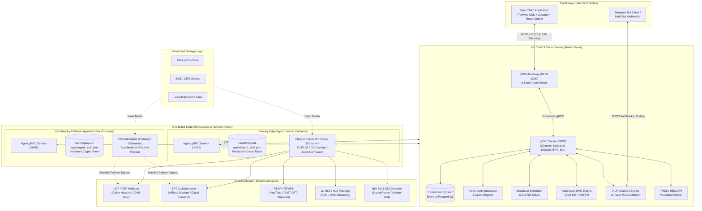
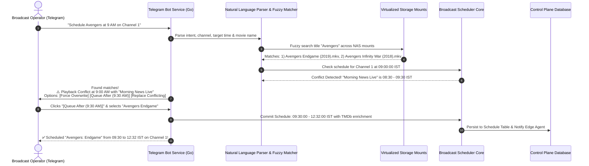

# System Architecture & Technical Design Specification
## Enterprise-Grade Cloud-Native TV Playout & Channel Automation Platform

---

## 1. System Architecture Overview



---

## 2. Core Service Components & Technology Stack

### 2.1 Technology Stack Selection
- **Frontend**: React 18+ with TypeScript, Tailwind CSS, Lucide React icons, `@tanstack/react-query`, `zustand` for real-time state, `i18next` for seamless Indian language translation, and `video.js` / WebRTC player for on-air live monitoring.
- **Backend Control Plane**: Golang 1.23+, `google.golang.org/grpc`, `grpc-ecosystem/grpc-gateway/v2` for unified REST APIs, `gorm` or `sqlc` with SQLite/PostgreSQL, `go-telegram-bot-api` for ChatOps.
- **Edge Playout Agent**: Headless Golang 1.23+ daemon running as a lightweight supervisory controller over modern `FFmpeg 7.x` / `GStreamer 1.24` broadcast pipelines, with hardware acceleration for NVIDIA NVENC, Intel QuickSync, and VAAPI.
- **Inter-Service Communication**: Protocol Buffers v3 (`proto3`) over HTTP/2 gRPC with bidirectional streaming for real-time frame telemetry, log forwarding, and health heartbeats.

---

## 3. Distributed Edge Agent & High Availability Redundancy

### 3.1 1+1 Hot Standby & Zero-Interruption Failover
In professional broadcast, a channel cannot go black. MCRFlow implements two redundancy topologies:

1. **Active-Passive Hot Standby (Zero-Disruption Edge Takeover)**:
   - Primary Agent and Fallback Agent run synchronized playlist clocks.
   - Primary Agent actively encodes and transmits downstream (UDP/SRT/RTMP).
   - Fallback Agent pre-buffers and decodes media into a shadow loop without outputting to the broadcast socket (or streaming to a standby SRT receiver).
   - Primary Agent sends high-frequency health heartbeats (every 500ms) over a gRPC stream (`ChannelHealthStream`) to the Control Plane:
     - Health payload includes: `frame_drop_count`, `encoder_fps`, `audio_rms_lufs`, `cpu_percent`, `gpu_percent`.
   - **Failover Trigger Condition**:
     - 3 consecutive missed heartbeats (1,500ms total elapsed time), OR
     - Primary agent self-reports fatal decoder stall / missing storage mount, OR
     - Control Plane detects audio silence / black frames via stream telemetry.
   - **Takeover Action**:
     - Control Plane immediately issues an authenticated `PromoteToActive` gRPC call to the Fallback Agent.
     - Fallback Agent engages stream sockets instantly (within < 100ms).
     - When using SRT Hitless Merge (SMPTE 2022-7 equivalent), both agents publish packet-synchronized streams to an edge SRT router, achieving 0-frame loss during transition.

2. **N+M Dynamic Floating Agent Pool**:
   - Multiple edge nodes serve as a shared hot standby pool for N active channels.
   - If any active agent fails, the Control Plane dispatches the channel playlist and current timecode offset to the least-utilized standby agent in the pool.

---

## 4. Cryptographic Agent Pairing & Token Lifecycle

### 4.1 Token Generation on Agent Initialization
To guarantee tamper-proof security without requiring manual pre-shared password entry in codebases:
1. When the Go Edge Agent boots, it checks for the existence of its auth credentials file at `/var/lib/mcrflow-agent/agent_auth.json`.
2. **First Boot (Token Creation)**:
   - The agent securely generates 32 cryptographically random bytes via `crypto/rand`.
   - Encoded as a hex-prefixed security token: `agt_sec_` + 64 hex characters (256-bit entropy).
   - Writes the token and agent UUID to `/var/lib/mcrflow-agent/agent_auth.json` with strict POSIX file permissions (`0600`).
   - The agent prints an unmistakable pairing banner to `stdout` (visible via `docker logs <agent_container>`):
     ```text
     ================================================================================
     [MCRFLOW AGENT INITIALIZED - PAIRING REQUIRED]
     Agent ID:    agent-delhi-dc1-01
     Listen Port: :9095 (gRPC)
     Persistent Pairing Token:
     agt_sec_8f43a9b2c011e749a1d2e8b409c2513f87a6b4c3d2e1f0a9b8c7d6e5f4a3b2c1
     
     Copy this token into MCRFlow Settings > Edge Agents to authorize this node.
     ================================================================================
     ```
3. **Subsequent Boots & Restarts**:
   - The agent detects the existing token file on persistent volume `/var/lib/mcrflow-agent`.
   - Reuses the existing token without resetting it.
   - Normal reboots or container restarts do NOT regenerate the token, maintaining active pairings uninterrupted.
4. **Token Revocation & Reset**:
   - Can be triggered remotely by an authorized Admin from the Control Plane UI (`ResetAgentToken` gRPC call).
   - Or locally by removing the volume file `/var/lib/playout-agent/agent_auth.json`.

### 4.2 Control Plane Authentication Interceptor
- All gRPC calls from the Control Plane to the Edge Agent (and heartbeats from the Agent to Control Plane) include an authorization metadata header:
  ```go
  ctx = metadata.AppendToOutgoingContext(ctx, "x-agent-token", registeredToken)
  ```
- The Edge Agent gRPC server implements a unary and stream interceptor that validates the token in constant time (`crypto/subtle.ConstantTimeCompare`) before processing any commands.

---

## 5. Storage Device Virtualization & File Management

Broadcast operations store terabytes of video content across diverse file systems:
1. **Mount Abstraction Drivers**:
   - **SMB / CIFS**: Integrated Linux cifs-utils mount or pure Go SMB2 client for cross-platform network shares.
   - **NFS v3/v4**: Network File System mount supporting enterprise NAS appliances (Synology, QNAP, TrueNAS, Isilon).
   - **Local Storage Alias**: Host file path aliased under friendly identifiers (e.g. `/mnt/fast_nvme/movies` -> `Main Vault`).
2. **Proactive FFprobe Ingestion Worker**:
   - When a storage source is browsed or a file selected, the storage worker triggers `ffprobe`:
     ```bash
     ffprobe -v quiet -print_format json -show_format -show_streams "/path/to/movie.mkv"
     ```
   - Automatically parses:
     - Exact duration down to millisecond precision (`duration_ts` and `duration`).
     - Video codec (`h264`, `hevc`, `prores`, `dnxhr`), resolution (`1920x1080`), framerate (`25/1`, `30000/1001`).
     - Embedded Audio Streams (PID indices, channel counts, audio codecs, language tags).
     - Embedded Subtitle Streams (`mov_text`, `subrip`, `dvb_subtitle`).
3. **Automatic End-Time Adjustment**:
   - $\text{Calculated End Time} = \text{Start Time} + \text{Probed Media Duration} + \text{Scheduled Ad Roll Overheads}$.
   - The UI automatically updates the schedule slot end time, eliminating manual calculation errors.

---

## 6. Seamless TMDb / IMDb Metadata Enrichment & EPG Pipeline

### 6.1 Inline Metadata Resolution
1. When the operator selects a video file in the scheduler (e.g., `Jawan.2023.1080p.Hindi.mkv`):
2. The system applies regex title-cleaning heuristics:
   - Strips extensions, resolution tags, audio codecs, and release groups.
   - Extracts base title: `"Jawan"` and release year: `"2023"`.
3. An inline asynchronous request hits TMDb API (`/3/search/movie?query=Jawan&year=2023&language=hi-IN`):
   - Returns candidate matches with official high-res posters, synopsis/plot overview, genres, director, and MPAA/CBFC rating.
   - Displays directly within the content selection panel on Screen 3.
4. The user can either accept the top match or type a custom search term if needed.
5. Upon confirmation, the rich metadata is cached locally in SQLite/PostgreSQL linked to the schedule item.

### 6.2 Automatic Multilingual EPG Distribution
- **DVB-SI EIT**: Injects standard DVB Event Information Tables with ISO 639-2 language descriptors (`hin`, `tam`, `tel`, `eng`) into the transport stream multiplexer.
- **XMLTV Feed**: Continuously rendered at `GET /api/v1/channels/{id}/epg.xml` for downstream OTT platforms.

---

## 7. Telegram Bot ChatOps & Natural Language Scheduling

### 7.1 Architecture & Workflow


---

## 8. Dual Docker Build Modes

The deployment architecture provides two specialized container distribution images:

### Mode 1: All-in-One Container (`mcrflow-all-in-one:latest`)
- **Target Audience**: Single-box TV stations, regional cable headends, testing labs, or compact deployments.
- **Contains**:
  - Embedded React UI static assets served by Go HTTP server.
  - Go Control Plane service (`mcrflow-control`).
  - Built-in Local Edge Playout Agent (`mcrflow-agent`).
  - Complete FFmpeg 7.x/8.x broadcast toolchain with GPU drivers.
  - Embedded SQLite database.
- **Port Mapping**:
  - `:8080` (Web UI & REST API Gateway).
  - `:9090` (gRPC Internal API).
  - `:5000-5010/udp` (Direct UDP Multicast/Unicast egress).
  - `:1935` (RTMP egress).

### Mode 2: Agent-Only Container (`mcrflow-agent-only:latest`)
- **Target Audience**: Distributed playout farms, cloud worker clusters, and multi-datacenter redundant edge nodes.
- **Contains**:
  - Headless Go Playout Agent binary (`/usr/local/bin/mcrflow-agent`).
  - FFmpeg & GStreamer broadcast runtime with NVIDIA NVENC / Intel QSV / VAAPI hardware acceleration.
  - No web UI or control database (ultra-lean footprint < 120MB base).
- **Persistent Volume Requirement**:
  - Mount `/var/lib/mcrflow-agent` to preserve the cryptographic pairing token `agent_auth.json` across container recreations.
- **Service Mesh & Intranet**:
  - Out-of-the-box support for Tailscale VPN sidecar or embedded Tailscale WireGuard client (`tailscale.com/tsnet`), enabling instant encrypted peer-to-peer communication with the Control Plane without port forwarding or static public IPs.

### Mode 3: Non-Docker Standalone Binaries (GoReleaser)
- **Target Audience**: Bare-metal broadcast playout servers, Windows Broadcast workstations, macOS M-series control rooms, or minimal Linux systems where Docker is not permitted.
- **Artifacts Published**:
  - `mcrflow-control` (Control Plane / All-in-One server): Linux (`amd64`, `arm64`), Windows (`amd64`), macOS (`darwin/amd64`, `darwin/arm64`).
  - `mcrflow-agent` (Headless Edge Playout Daemon): Linux (`amd64`, `arm64`), Windows (`amd64`), macOS (`darwin/amd64`, `darwin/arm64`).
- **Release Automation**: Integrated via `.goreleaser.yaml` and GitHub Actions release pipeline (`.github/workflows/release.yml`). Includes SHA-256 checksums, ZIP/tar.gz packaging, and binary self-hosting.
